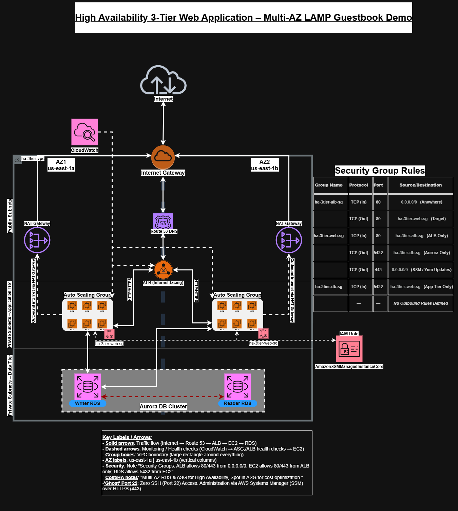
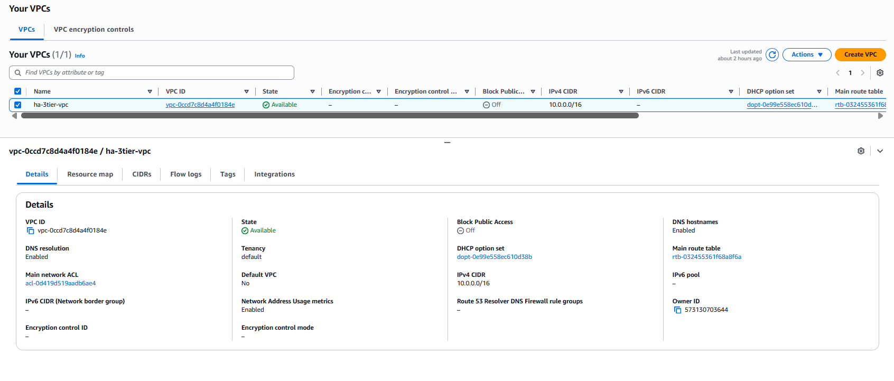
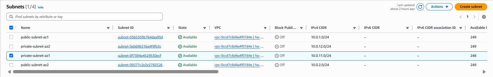
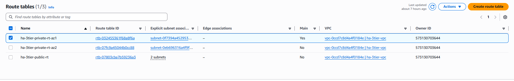
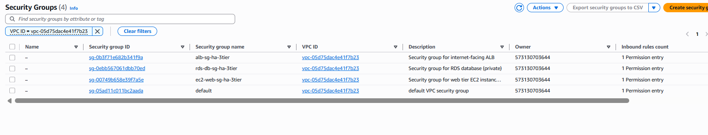
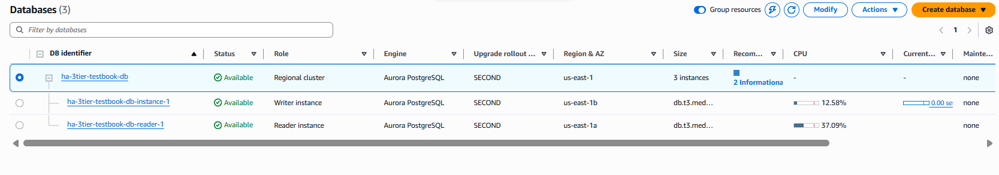
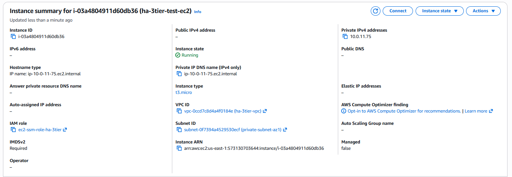
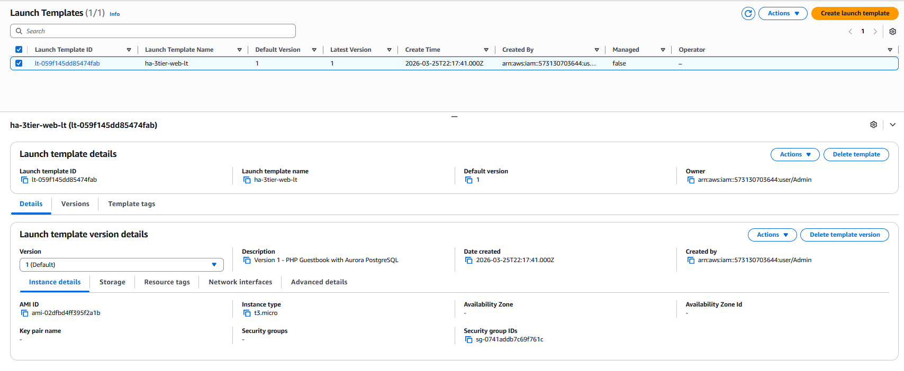
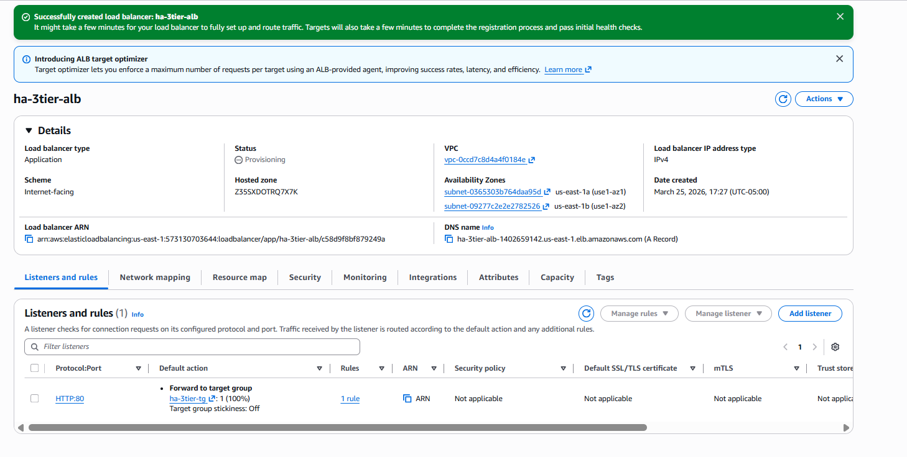

# AWS High-Availability 3-Tier Web Migration Demo

**Portfolio project for AWS Solutions Architect – Associate (SAA-C03) preparation.** This project demonstrates a production-grade migration of a monolithic application to a highly available, scalable, and secure 3-tier architecture on AWS.

---

## 🏗️ Architecture Overview
- **Public Layer**: Internet-facing Application Load Balancer (ALB)
- **Application Layer**: Auto Scaling Group of EC2 instances in private subnets (Multi-AZ)
- **Data Layer**: Aurora PostgreSQL database cluster with Multi-AZ deployment
- **Networking**: Custom VPC with public/private subnets, Dual Zonal NAT Gateways (HA), and proper route tables
- **Security**: Least-privilege security groups and Network ACLs

> **🔍 Architectural Deep Dive:** This design prioritizes **Fault Tolerance** over cost-savings. By deploying dual Zonal NAT Gateways and an Aurora Multi-AZ Cluster, the application can sustain the complete failure of a single AWS Availability Zone (AZ) with zero data loss and automated failover in under 30 seconds.

## Project Features
- Multi-AZ high availability for both compute and database layers
- Private web tier with public ALB
- Auto Scaling with target tracking (CPU-based)
- Secure database access using security group referencing
- Infrastructure built with manual console + reusable Launch Template
---

## Phase 1 – VPC & Networking (The Foundation)

- **VPC CIDR:** `10.0.0.0/16`
- **Multi-AZ Design:** Public & private subnets across two AZs for fault tolerance.
- **Egress Strategy:** Used a **Public NAT Gateway** to provide outbound internet access for private instances (required for patching and SSM connectivity).
- **Routing Logic:** - Public Route Table -> Internet Gateway (IGW).
                     - Private Route Table -> NAT Gateway.

> ### 💡 Key Lesson: The "NACL Trap"
> During deployment, I encountered a "Silent Timeout" where the SSM Agent could not connect. I identified that the **Network ACL (NACL)** was blocking Outbound HTTPS (Port 443). I resolved this by adding a stateful rule to allow 443, ensuring the private instances could "call home" to AWS APIs.
> During the build, I discovered that placing an instance in a Public Subnet without a Public IP creates a routing loop. I corrected this by moving all application logic to Private Subnets, ensuring the NAT Gateway was the primary egress point.

###⚖️ Architectural Decision: Zonal NAT Gateways for High Availability
In this deployment, I opted for a Zonal NAT Gateway architecture (one NAT Gateway per Availability Zone) to ensure maximum fault tolerance and align with the AWS Well-Architected Framework.

-The Rationale:
High Availability (HA): By deploying a NAT Gateway in both us-east-1a and us-east-1b, the egress path for the private application tier is fully redundant.

-Fault Isolation: If a service disruption occurs in us-east-1a, the instances in us-east-1b maintain uninterrupted internet connectivity for SSM management, patching, and API calls through their own local NAT Gateway.

-Cost Efficiency (Data Transfer): While this increases the hourly fixed cost, it eliminates Inter-AZ Data Transfer charges ($0.01/GB) that occur when traffic crosses AZ boundaries to reach a single regional NAT.

-The Implementation:
    Redundant Routing: Created two distinct Private Route Tables:
        - **ha-3tier-private-rt-az1 routes 0.0.0.0/0 to the NAT in 1a.
        - **ha-3tier-private-rt-az2 routes 0.0.0.0/0 to the NAT in 1b.
    Infrastructure Health: This ensures that a failure in one AZ’s networking stack does not "poison" the connectivity of the other AZ.
---

## Phase 2 – Security, Data Tier & RDS
- Layered security groups: ALB → EC2 → RDS
- Aurora PostgreSQL Multi-AZ cluster in private subnets
- Manual security group configuration for EC2-to-RDS access
  
### 🛡️ Security Group Matrix (Least-Privilege Model)
| Security Group | Inbound Rules | Outbound Rules | Purpose |
| :--- | :--- | :--- | :--- |
| **ha-3tier-alb-sg** | HTTP (80) from `0.0.0.0/0` | HTTP (80) to `ha-3tier-web-sg` | Public entry point; health checks instances. |
| **ha-3tier-web-sg** | HTTP (80) from `ha-3tier-alb-sg` | PostgreSQL (5432) to `ha-3tier-db-sg` HTTPS (443) to `0.0.0.0/0` | Private app tier; 443 allows SSM & Yum updates via NAT. |
| **ha-3tier-db-sg** | PostgreSQL (5432) from `ha-3tier-web-sg` | None (Default Deny) | Isolated data tier; only accessible from app tier. |

- **Security Group Chaining:** Implemented a "Least Privilege" model where:
    - **ALB SG:** Allows HTTP (80) from `0.0.0.0/0`.
    - **EC2 SG:** Allows HTTP (80) **only** from the ALB Security Group ID.
    - **RDS SG:** Allows PostgreSQL (5432) **only** from the EC2 Security Group ID.
- **Aurora PostgreSQL (Multi-AZ):** Configured for high performance with 6-way replication and automated failover.

---

## Phase 3 – Test EC2 Instance
- EC2 instance in private subnet with Session Manager access
- Apache + PHP + PostgreSQL driver installed
- Initial application deployment and testing

---

## Phase 4 – Launch Template
- Reusable Launch Template with user data for automated application deployment
- Includes Apache, PHP, and guestbook application

To ensure the application tier is **stateless** and **self-healing**, I developed a Bash bootstrap script used within the EC2 Launch Template.

### 📜 User Data Script Highlights:
- **Automated Stack:** Installs Apache, PHP, and PostgreSQL drivers on boot.
- **Self-Healing Schema:** Logic includes `CREATE TABLE IF NOT EXISTS`,
- 

---

## Phase 5 – Auto Scaling Group & ALB
- Auto Scaling Group running across two private subnets (Multi-AZ)
- Target tracking scaling policy (CPU 70%)
- Internet-facing Application Load Balancer with target group

---

## Final Application
Live demo accessible via the ALB DNS name.

**Key Learnings:**
- Proper VPC design with public/private separation
- Security group referencing for least privilege
- Multi-AZ high availability patterns
- Auto Scaling and load balancing best practices
- Troubleshooting connectivity issues (security groups, NACLs, routing)

## 🚀 Future Improvements / Scale-Out Strategy
To evolve this architecture into a global-scale production environment, the following enhancements are recommended:
* **Edge Caching:** Integrate **Amazon CloudFront** to cache static assets, reducing latency for global users and lowering ALB throughput costs.
* **Web Security:** Deploy **AWS WAF** (Web Application Firewall) to protect the ALB from common exploits like SQL Injection and Cross-Site Scripting (XSS).
* **Infrastructure as Code (IaC):** Migrate this manual deployment to **Terraform** or **AWS CDK** to enable version-controlled, repeatable infrastructure.
* **Secret Management:** Move hardcoded DB credentials to **AWS Secrets Manager** with automated rotation.

## Technologies Used
- VPC, Subnets, Route Tables, Regional NAT Gateway
- Security Groups & Network ACLs
- EC2, Launch Templates, Auto Scaling Groups
- Application Load Balancer
- Aurora PostgreSQL (Multi-AZ)

---
